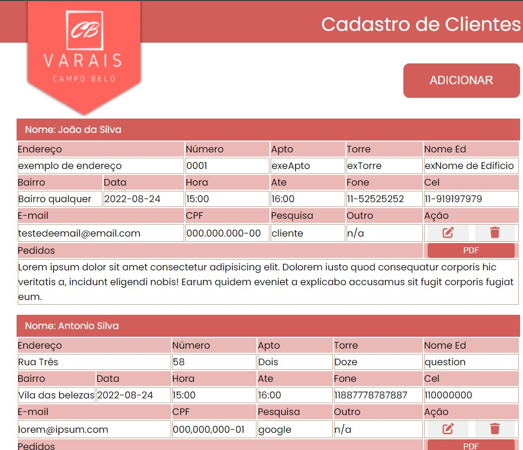
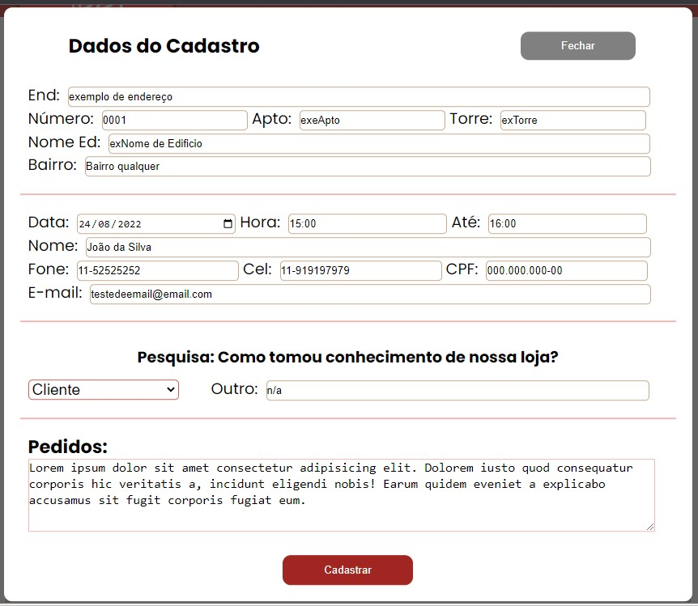
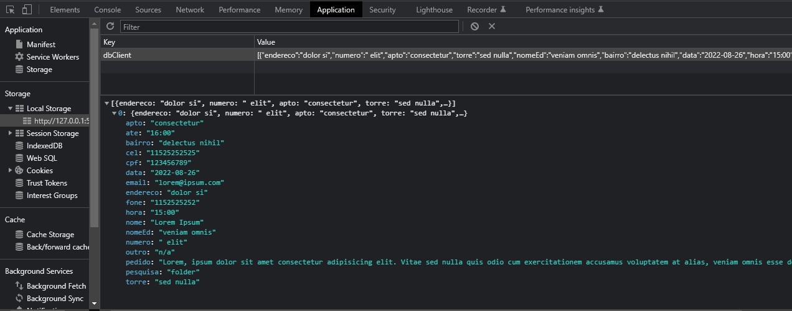

# varais-campo-belo
 Aplicação web para cadastro de clientes.

 ### link da aplicação rodando
 [varais-campo-belo](https://antoniojonilei.github.io/varais-campo-belo/)

- Tabela para exibir os dados armazenados, com botão tendo a funcionalidade de abri um modal com o formulário
- Para cada cliente cadastrado, um botão com funcionaliade de editar as informações, um botão para excluir o cliente e um botão para salvar as informações em formato PDF (utilizando a lib jsPDF)

- Modal com o formulário
- Botão com funcionalidade de adicionar informações e cadastrar cliente
- Botão com funcionalidade de fechar e cancelar

- CRUD com JavaScript utilizando o localStorage do navegador para armazenar os dados inseridos no formulário

